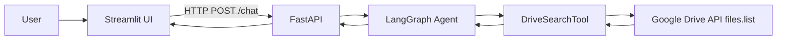

# Google Drive AI Search Agent

Production-style demo: a **conversational assistant** that turns natural language into **Google Drive `q` queries**, executes **`files.list`**, and returns **structured, linkable results**. The stack is **Streamlit → FastAPI → LangGraph (tool calling) → Google Drive API**.


## Features

- **Natural language** search, filters, and follow-ups (“now only the finance PDFs”).
- **LangGraph** agent with **tool calling** and **multi-turn session memory** (`session_id`).
- **Drive `q` coverage**: `name`, `name contains`, `mimeType`, `fullText`, `modifiedTime`, multi-clause `and` / `or`, always scoped to a folder + `trashed=false`.
- **Semantic re-ranking** (optional): embedding similarity re-orders the current result set (`ENABLE_SEMANTIC_RERANK`).
- **Streaming** NDJSON endpoint for a typing-style UX (`POST /chat/stream`).
- **Polished Streamlit UI**: dark theme, cards, expandable results, tool logs, query explanations.

## Architecture



## Repository layout

```
google-drive-ai-agent/
├── backend/                 # FastAPI + LangGraph + Drive service
├── frontend/                # Streamlit chat client
├── docker-compose.yml       # Optional all-in-one run
└── secrets/                 # Put service-account.json here (see secrets/README.txt)
```

## Prerequisites

- **Python 3.11+** recommended (some LangChain warnings appear on very new Python versions like 3.14, but the code imports cleanly).
- **OpenAI API key** for `gpt-4o-mini` (override with `OPENAI_MODEL`).
- **Google Cloud project** with **Drive API** enabled.
- A **service account** JSON key and a **Drive folder** shared with that service account (Viewer access is sufficient).

## Google Cloud setup (high level)

1. Create/select a GCP project.
2. Enable **Google Drive API**.
3. Create a **service account** and download a JSON key.
4. Copy the target **Drive folder ID** from the folder URL.
5. In Drive, **share the folder** with the service account email (`…@….iam.gserviceaccount.com`).

## Environment variables

Copy `backend/.env.example` → `backend/.env` and set:

| Variable | Purpose |
|---------|---------|
| `OPENAI_API_KEY` | OpenAI key |
| `GOOGLE_SERVICE_ACCOUNT_FILE` | Absolute or relative path to the service account JSON |
| `GOOGLE_DRIVE_FOLDER_ID` | Folder to scope all searches |

Optional:

- `OPENAI_MODEL` (default `gpt-4o-mini`)
- `CORS_ORIGINS` (comma-separated; include your Streamlit origin)
- `DRIVE_PAGE_SIZE` (default `25`)
- `ENABLE_SEMANTIC_RERANK` (`true`/`false`)
- `BACKEND_PUBLIC_URL` (used by docs/examples)

## Run locally

### 1) Backend

```bash
cd backend
pip install -r requirements.txt
copy .env.example .env   # Windows: copy; macOS/Linux: cp
# edit .env
uvicorn app.main:app --reload --host 0.0.0.0 --port 8000
```

Health: `GET http://127.0.0.1:8000/health`  
Readiness (checks key file path): `GET http://127.0.0.1:8000/ready`

### 2) Frontend

```bash
cd frontend
pip install -r requirements.txt
streamlit run app.py
```

From the repository root you can also run:

```bash
streamlit run frontend/app.py
```

Set `BACKEND_URL` (optional) if the API is not on `http://127.0.0.1:8000`.

## API contract

### `POST /chat`

Request:

```json
{ "message": "Find PDF reports from last month", "session_id": "optional-uuid" }
```

Response (trimmed):

```json
{
  "response": "…natural language summary…",
  "results": [
    {
      "id": "…",
      "name": "…",
      "mimeType": "application/pdf",
      "modifiedTime": "2026-04-12T18:22:10.000Z",
      "webViewLink": "https://drive.google.com/file/d/…/view"
    }
  ],
  "session_id": "…",
  "drive_q_used": "((…) and 'FOLDER_ID' in parents and trashed=false)",
  "tool_logs": ["…"],
  "query_explanation": "…",
  "semantic_ranked": true,
  "error": null,
  "suggestions": ["Show only PDFs", "Only files modified this week"]
}
```

### `POST /chat/stream`

Returns **NDJSON** lines:

- `{"type":"meta", ...}`
- `{"type":"token", "text":"…"}` (word-chunked assistant text)
- `{"type":"final", ...}` (same fields as `/chat` plus structured `results`)

## Docker

1. Put your key at `secrets/service-account.json` (or adjust the volume in `docker-compose.yml`).
2. Create `backend/.env` with at least:

```
OPENAI_API_KEY=...
GOOGLE_SERVICE_ACCOUNT_FILE=/app/service-account.json
GOOGLE_DRIVE_FOLDER_ID=...
```

3. Run:

```bash
docker compose up --build
```

- API: `http://localhost:8000`
- UI: `http://localhost:8501`

## Example queries

- “Find resumes”
- “PDFs about finance modified in April”
- “Search inside files for ‘budget’”
- “Show only spreadsheets from last week”
- Follow-up: “Now narrow to marketing” / “Only PDFs” / “Sort idea: show the newest first” (the agent will refine the Drive `q`)

## Screenshots

> Add your own screenshots here after first successful run (Drive + OpenAI configured):
>
> 1. Streamlit chat with results expanded  
> 2. FastAPI `/docs` showing `POST /chat`

## Tech stack

- **FastAPI**: HTTP API, validation, CORS, streaming response.
- **LangGraph**: cyclic agent + tool execution with memory-friendly message reducers.
- **LangChain OpenAI**: chat model + tool binding + embeddings (re-rank).
- **Google API Python Client**: `drive.files().list` with `q`.
- **Streamlit**: rapid polished UI with custom CSS.

## Reliability & security notes

- Never commit service account JSON or `.env`.
- The backend **always** appends folder scope + `trashed=false` in `drive_service.py` even if the model forgets.
- Rate limits and invalid `q` strings surface as **user-safe** errors.

## Future improvements

- **Vector index** (Chroma/FAISS) over file text for true corpus semantic search beyond re-ranking.
- **Shared session store** (Redis) for multi-worker deployments.
- **OAuth user delegation** instead of a service account where appropriate.
- **Inline file preview** via Drive export where MIME types allow.
- **Stronger query validation** / sandboxing for `q` fragments.


